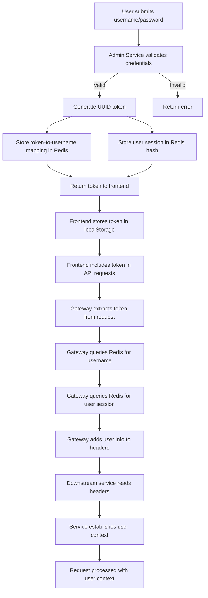
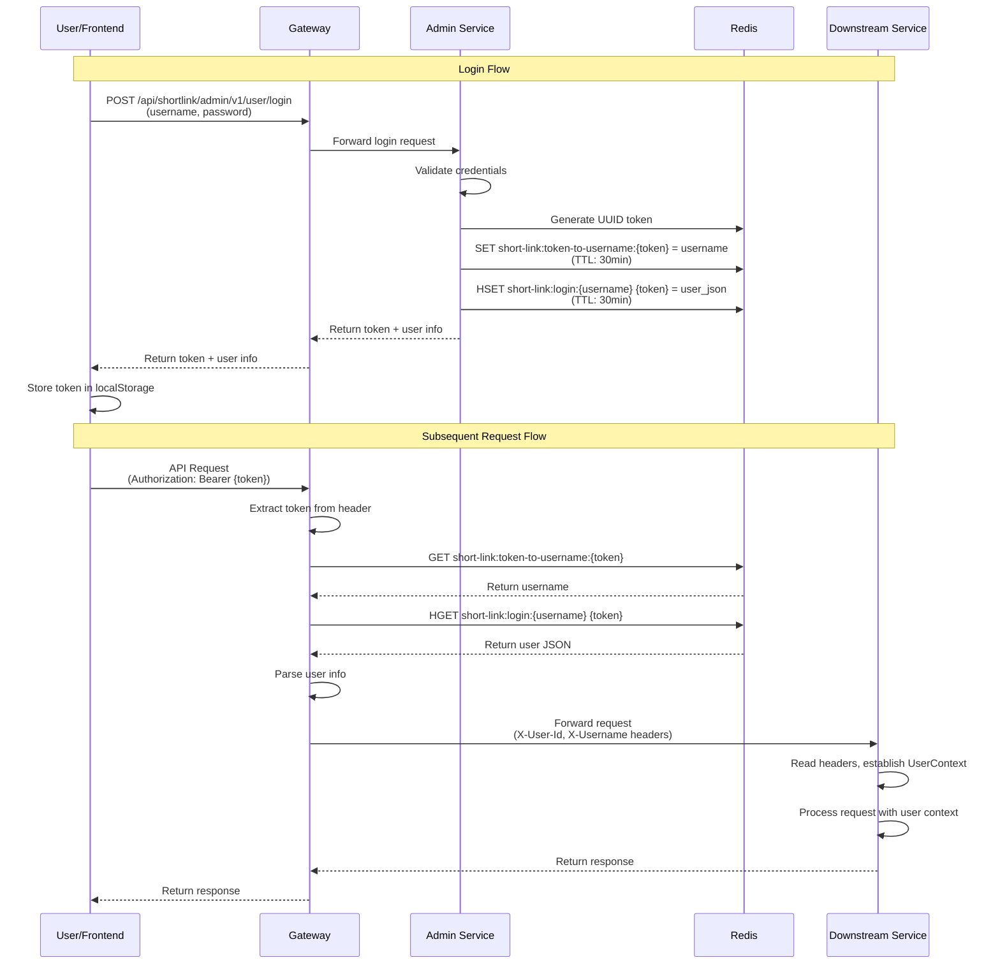
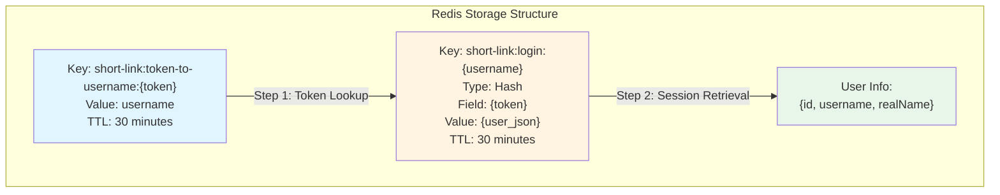

# Building a Simple Authentication System: Our Journey from Zero to One

Our shortlink platform is a high-performance URL shortening service designed to handle millions of daily requests. Like
many modern web applications, we needed a robust authentication system that could scale with our growth while remaining
simple enough to maintain and extend. When we first started building this platform, authentication was one of those
features that seemed straightforward at first glance. Users need to log in with username and password, get a token, and
use that token for subsequent requests. Simple, right? Well, as we discovered, even the simplest authentication flow has
its nuances, and getting it right from the beginning saves a lot of headaches later.

## Project Background

Our platform consists of a React frontend and a Spring Boot-based microservices backend. The initial authentication
implementation was straightforward: users provide their username and password through a login form, and upon successful
validation, the backend generates a UUID token and stores the session in Redis. The frontend stores this token in
localStorage and includes it in every subsequent API request. This simple approach served us well in the early stages,
but as we'll see, the implementation details matter more than we initially thought.

## The Foundation: Token-Based Authentication

Our authentication system follows a classic token-based approach, which is familiar to most developers working with
modern web applications. When a user successfully logs in with their username and password, our system generates a
unique token—a UUID string that serves as a temporary credential. This token becomes the user's passport for all
subsequent API calls, eliminating the need to send credentials with every request.

The beauty of this approach lies in its simplicity. The frontend stores the token in localStorage after login, and every
API request includes this token in the request headers. Our backend services validate the token and extract user
information, allowing the request to proceed with the appropriate user context.

### Authentication Flow Diagram

The following diagram illustrates the complete authentication flow from login to request processing:

### Login and Request Sequence Diagram

The sequence of interactions during login and subsequent requests:

## The Login Flow: From Credentials to Token

The journey begins when a user submits their credentials through our login endpoint. Our system performs the standard
validation checks—verifying the username exists, the password matches, and the account is active. Once these checks
pass, we generate a UUID token and establish a session in Redis.

The session storage follows a two-step mapping strategy that we've found to be both efficient and flexible. First, we
create a reverse mapping from token to username, stored as `short-link:token-to-username:{token}`. This allows us to
quickly identify which user a token belongs to. Second, we store the complete user session information in a Redis hash
under the key `short-link:login:{username}`, using the token as the hash field. This dual-structure approach gives us
fast token-to-user resolution while maintaining the ability to manage multiple concurrent sessions per user if needed.

After establishing the session, we return the token to the frontend, which stores it for future use. The frontend then
includes this token in subsequent requests, typically in the Authorization header as `Bearer {token}`, though we also
support cookie-based and query parameter fallbacks for backward compatibility.

## Request Processing: Extracting User Context

When a request arrives at our Gateway, the first step is extracting the token from the request. We check multiple
sources in priority order: the Authorization header first, then cookies, and finally query parameters as a fallback.
This multi-source approach ensures compatibility with different client implementations while maintaining security best
practices.

Once we have the token, we need to resolve it to user information. In our original implementation, this resolution
happened directly in the Gateway filter. The filter would query Redis using the token-to-username mapping to get the
username, then look up the user session hash to retrieve the complete user information. This information was then added
to request headers and passed downstream to our backend services.

The downstream services—our Admin and Shortlink modules—have their own filters that read these headers and establish a
user context. This context is stored in a thread-local variable, making it accessible throughout the request processing
lifecycle without needing to pass user information as method parameters.

## The Redis Session Store

Redis plays a crucial role in our authentication architecture, serving as our session store. We chose Redis for its
speed, simplicity, and built-in expiration capabilities. Each token has a TTL (time-to-live), ensuring that sessions
automatically expire after a period of inactivity, which is essential for security.

The session data structure we use is straightforward: a JSON representation of the user's essential information,
including user ID, username, and real name. This information is sufficient for most of our authorization checks and user
context requirements, without needing to query the database for every request.

### Redis Session Storage Structure

Our Redis storage uses a dual-mapping strategy that provides both fast token lookup and flexible session management:

**Token-to-Username Mapping**: This reverse mapping allows us to quickly identify which user a token belongs to. The key
format is `short-link:token-to-username:{token}`, and the value is simply the username string. This structure enables
fast O(1) token validation.

**User Session Hash**: The actual session data is stored in a Redis hash under the key `short-link:login:{username}`.
The hash uses the token as the field name and stores a JSON representation of the user's information as the value. This
design allows a single user to have multiple active sessions (different tokens) if needed, which is useful for
multi-device scenarios.

One interesting aspect of our design is the reverse mapping from token to username. This might seem redundant at
first—why not just store everything under the token key? The answer lies in flexibility. By separating the
token-to-username mapping from the user session data, we can easily implement features like session management, where a
user might have multiple active sessions, or session revocation, where we need to invalidate all sessions for a user.

## Challenges and Trade-offs

Like any system, our authentication approach has its trade-offs. The simplicity of UUID tokens means they're
opaque—there's no way to extract information from the token itself without querying Redis. This creates a dependency on
Redis availability for every authenticated request, which is a single point of failure we need to manage carefully.

We've also found that the dual Redis lookup—first token to username, then username to session—adds a small latency
overhead. While this is negligible for most use cases, it becomes noticeable under high load. However, the flexibility
this structure provides has proven valuable as we've added features like multi-device login support.

Another challenge we've encountered is token management. Since tokens are opaque UUIDs, there's no built-in way to check
if a token is expired or revoked without querying Redis. This means we need to ensure Redis TTLs are properly configured
and that we have mechanisms in place to handle token revocation scenarios.

## Looking Forward

Our current authentication system serves us well for the scale we're operating at, but we're already thinking about the
next evolution. The foundation we've built—with clear separation between token extraction, validation, and user context
establishment—provides a solid base for future enhancements.

The modular design we've adopted, where Gateway handles token extraction and header propagation while downstream
services handle context establishment, gives us flexibility. As we grow and our requirements evolve, we can enhance
individual components without disrupting the entire system.

What we've learned from building this system is that good architecture matters, even for seemingly simple features. The
decisions we made early on—like the dual Redis mapping structure and the multi-source token extraction—have proven
valuable as we've scaled. And the clear separation of concerns we've maintained has made it easier to reason about the
system and make improvements incrementally.
