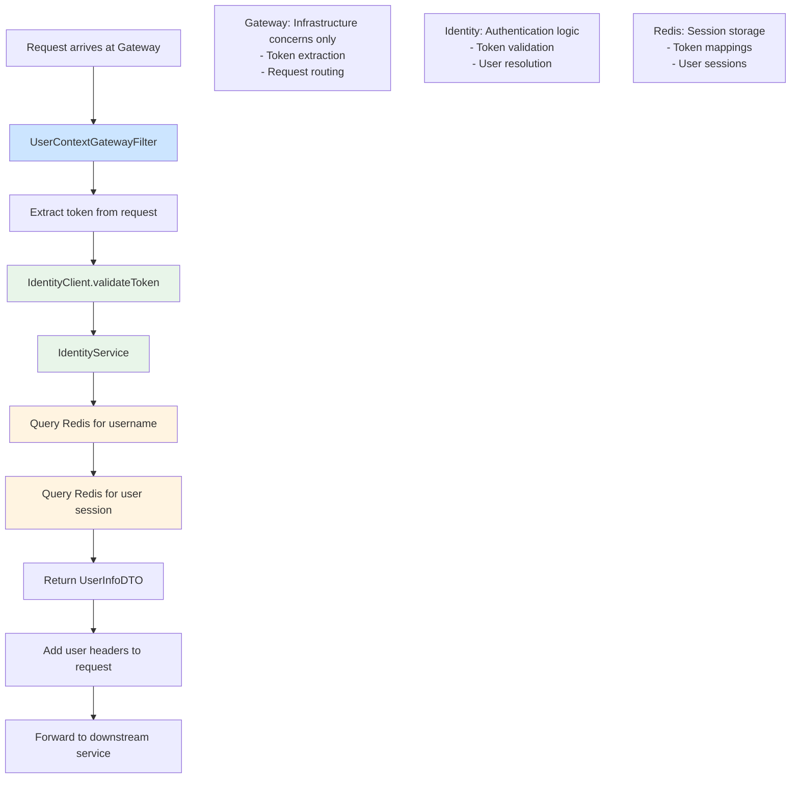
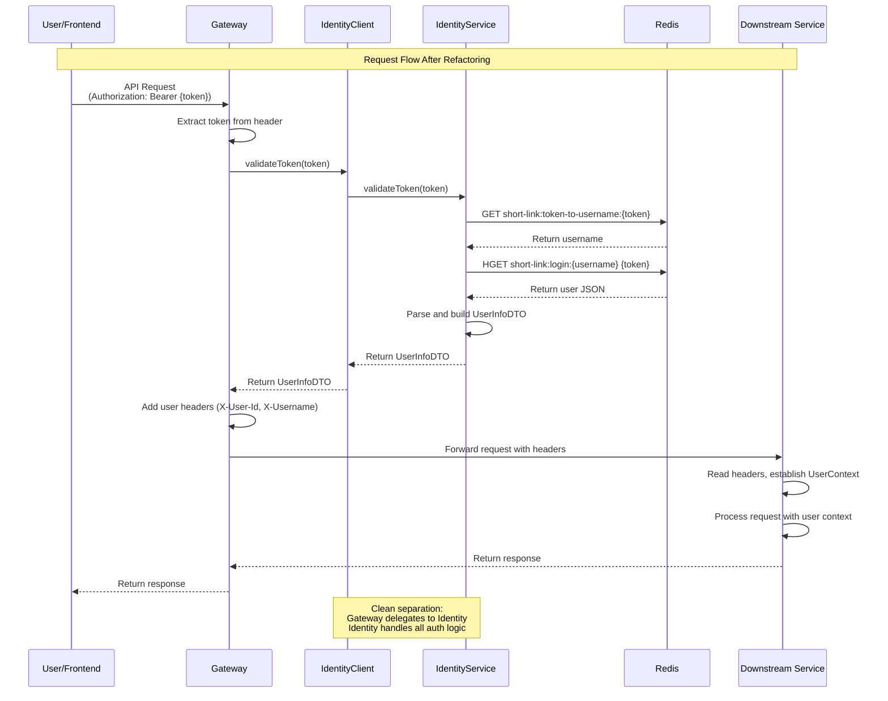
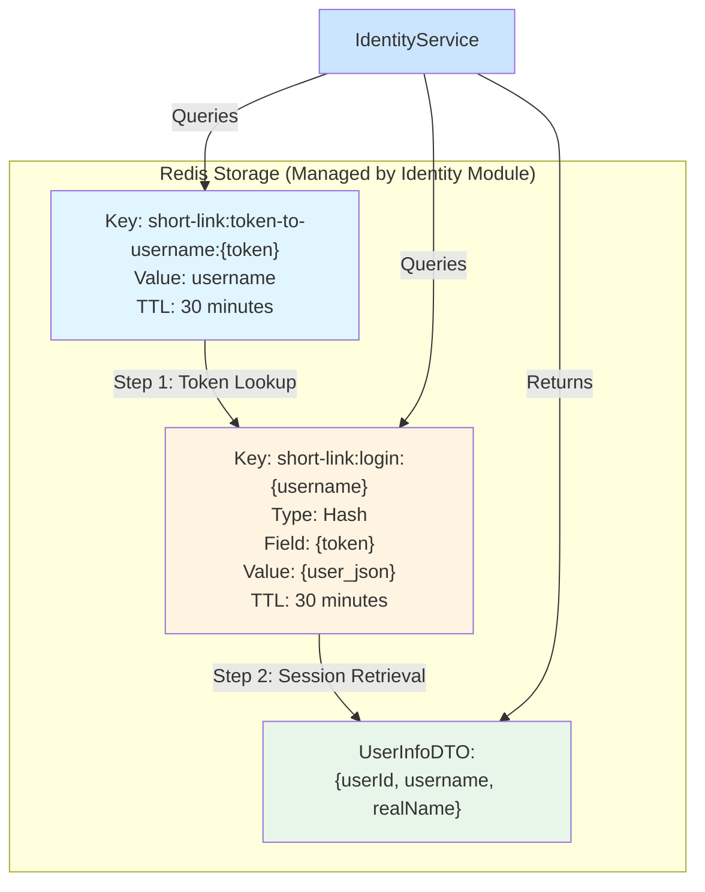

# Refactoring Authentication: Extracting Identity Logic from Gateway

Our shortlink platform is a high-performance URL shortening service handling millions of daily requests. The platform consists of a React frontend and a Spring Boot-based microservices backend, with authentication initially implemented as a simple username/password login system that generates UUID tokens stored in Redis. As our platform grew, we noticed something happening in our Gateway module. What started as a simple routing layer was gradually accumulating business logic, particularly around authentication and identity management. The Gateway filter that was supposed to just extract tokens and pass them along had evolved into a complex component that directly queried Redis, parsed session data, and managed user context resolution. This wasn't just a code smell—it was a fundamental architectural issue that needed addressing.

## Project Context

Before diving into the refactoring, it's important to understand our starting point. Our authentication system began with a straightforward implementation: users provide username and password through the frontend, the Admin service validates credentials and generates a UUID token, and this token is stored in Redis with a dual-mapping structure (token-to-username and username-to-session). The Gateway was responsible for extracting tokens from incoming requests and resolving them to user information by directly querying Redis. While this worked, it created tight coupling between Gateway and our authentication implementation details.

## The Problem: Gateway Doing Too Much

The Gateway's primary responsibility should be infrastructure-level concerns: routing requests, load balancing, rate limiting, and request/response transformation. Authentication logic, while important, is a business concern that doesn't belong in the Gateway layer. When we looked at our `UserContextGatewayFilter`, we saw Redis key construction, session parsing, error handling for authentication failures, and even some business logic around user context establishment.

### Original Architecture: Gateway with Embedded Auth Logic

The following diagram shows how authentication logic was embedded directly in the Gateway:

```mermaid
flowchart TD
    A[Request arrives at Gateway] --> B[UserContextGatewayFilter]
    B --> C[Extract token from request]
    C --> D[Construct Redis key:<br/>short-link:token-to-username:{token}]
    D --> E[Query Redis for username]
    E --> F[Construct Redis key:<br/>short-link:login:{username}]
    F --> G[Query Redis hash for token field]
    G --> H[Parse JSON user data]
    H --> I[Add user headers to request]
    I --> J[Forward to downstream service]
    
    style B fill:#ffcccc
    style D fill:#ffcccc
    style E fill:#ffcccc
    style F fill:#ffcccc
    style G fill:#ffcccc
    style H fill:#ffcccc
    
    Note1[Gateway doing too much:<br/>- Token extraction<br/>- Redis key construction<br/>- Redis queries<br/>- JSON parsing<br/>- User context management]
```

This tight coupling created several problems. First, any change to our authentication logic required modifying Gateway code, which increased the risk of breaking routing functionality. Second, the Gateway had direct dependencies on Redis and our session data structures, making it harder to test and more fragile. Third, when we wanted to add new authentication mechanisms—like JWT tokens or OAuth2—we'd have to modify Gateway code, which should remain stable and focused.

Perhaps most importantly, this design violated the single responsibility principle. The Gateway was doing routing, rate limiting, authentication, and user context management. As we planned to scale and potentially deploy Identity as a separate service, we realized we'd need to extract this logic anyway. Better to do it now, while the system is still manageable.

## The Solution: Introducing the Identity Module

We decided to extract all authentication and identity logic into a dedicated Identity module. This module would centralize token validation, user resolution, and session management, providing a clean interface that Gateway and other services could use without knowing the implementation details.

The refactoring followed a clear pattern. We created an `IdentityService` interface that encapsulates token validation logic, and an `IdentityClient` interface that provides a client-side abstraction. This client abstraction is crucial—it allows us to use the Identity module in-process today (as a library) while making it easy to switch to HTTP calls when we deploy Identity as a separate service in the future.

The implementation was straightforward but required careful attention to detail. We moved the Redis lookup logic from Gateway's filter into `IdentityServiceImpl`, maintaining the exact same behavior but in a more appropriate location. We updated Gateway's filter to simply call `identityClient.validateToken(token)` instead of performing the Redis queries directly. The same pattern was applied to our Admin module's `AdminUserInfoResolver`, which had similar direct Redis access.

## What Changed: The Refactoring Details

The most visible change was in the Gateway filter. Previously, it contained code that constructed Redis keys, queried Redis for token-to-username mappings, retrieved user session data, and parsed JSON. Now, it simply extracts the token from the request and delegates validation to the Identity client. The filter is cleaner, more focused, and easier to understand.

In the Admin module, we applied the same pattern. The `AdminUserInfoResolver` that previously had direct Redis dependencies now delegates to `IdentityClient`. This creates consistency across our codebase—both Gateway and Admin use the same identity resolution mechanism, reducing duplication and ensuring consistent behavior.

We also introduced proper configuration. The Identity module can operate in two modes: as an in-process library (current) or as a separate HTTP service (future). This is controlled through configuration, allowing us to switch modes without code changes. The in-process mode uses direct method calls for maximum performance, while the HTTP mode uses WebClient for service-to-service communication.

## The Architecture: Clean Separation of Concerns

The new architecture creates clear boundaries. Gateway focuses on routing, rate limiting, and request transformation. Identity handles all authentication concerns. Downstream services (Admin, Shortlink) receive user context through headers and establish their own context using filters from the base module.

### Refactored Architecture Diagram

The new architecture clearly separates concerns:



### Refactoring Sequence Diagram

The sequence of interactions after refactoring:



This separation brings immediate benefits. Gateway code is simpler and more maintainable. Identity logic is centralized, making it easier to test, debug, and enhance. The client abstraction allows us to evolve the implementation without affecting consumers. And the clear boundaries make it obvious where new features should go.

The dependency flow is now unidirectional: Gateway and Admin depend on Identity, but Identity doesn't depend on Gateway or Admin. This makes the system more modular and easier to reason about. Identity can evolve independently, and we can even deploy it as a separate service when needed without major architectural changes.

### Session Storage: Unchanged but Better Organized

The Redis session storage structure remains the same, but now it's managed by the Identity module:



## Future Enhancements: Building on Solid Foundations

With the Identity module in place, we have a clear path for future enhancements. The current implementation uses Redis-based session lookup, but the architecture supports adding new authentication mechanisms without disrupting existing functionality.

**JWT Token Support** is our next priority. The Identity module's interface is already designed to handle different token types—we just need to add token type detection and JWT parsing logic. The client abstraction means Gateway and other services won't need changes when we add JWT support. We'll implement automatic token type detection based on format, supporting both our existing UUID tokens and new JWT tokens seamlessly.

**OAuth2 and OIDC Integration** becomes straightforward with our modular design. We can add OAuth2 providers as new identity sources within the Identity module, and the client interface remains unchanged. This means we can support third-party authentication (like Google, GitHub, or enterprise SSO) without modifying Gateway or downstream services.

**Token Revocation and Management** is another area we're planning to enhance. Currently, tokens expire based on Redis TTL, but we want more control. We'll add a token revocation mechanism, potentially backed by a database for persistence, while maintaining Redis for performance. The Identity module's abstraction makes this transparent to consumers.

**Multi-Tenant Support** becomes easier with centralized identity logic. We can add tenant context to the identity resolution process, enabling features like organization-level authentication and authorization. The Gateway and downstream services won't need changes—they'll just receive additional context through the user information.

## The Gains: What This Refactoring Brings

The immediate benefits are clear: cleaner code, better separation of concerns, and improved maintainability. But the real value becomes apparent when we think about the future.

**Scalability** improves because Identity can be deployed as a separate service, allowing independent scaling. When authentication becomes a bottleneck, we can scale Identity without affecting Gateway or other services. The HTTP client mode we've built supports this transition seamlessly.

**Testability** is significantly better. Identity logic can be tested in isolation, with clear interfaces and minimal dependencies. Gateway tests no longer need to mock Redis or understand session data structures—they just verify that tokens are extracted and passed to Identity correctly.

**Flexibility** is perhaps the biggest gain. We can add new authentication mechanisms, support new token types, integrate with external identity providers, or change our session storage strategy—all within the Identity module, without touching Gateway or downstream services. This makes our system more adaptable to changing requirements.

**Developer Experience** improves because the code is easier to understand. New developers can quickly grasp what Gateway does (routing) and what Identity does (authentication) without getting lost in implementation details. The clear boundaries make onboarding faster and reduce cognitive load.

**Security** benefits from centralization. Security improvements, vulnerability fixes, and best practices can be applied in one place and benefit all consumers. Audit logging, security monitoring, and compliance features become easier to implement when identity logic is centralized.

As we continue to evolve our platform, this refactoring provides a solid foundation. The Identity module gives us a clear place to add new features, and the clean separation of concerns ensures that changes remain manageable. We've learned that good architecture isn't just about solving today's problems—it's about creating a structure that makes tomorrow's problems easier to solve.
